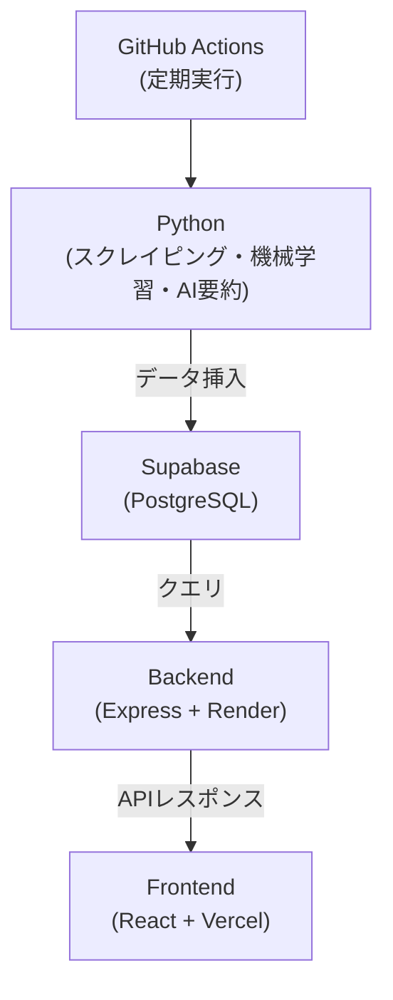

# AI求人ダッシュボード

**バージョン:** v1.0.0（公開中）  
AIと機械学習を活用して、求人データを自動収集・分析・可視化するフルスタックWebアプリケーションです。  
GitHub Actionsによる定期実行で最新データを自動更新しています。

---

## デモサイト

- フロントエンド（Vercel）  
  [https://ai-job-dashboard-plum.vercel.app](https://ai-job-dashboard-plum.vercel.app ) 
- バックエンド（Render / REST API）  
  [https://ai-job-dashboard-ztxo.onrender.com](https://ai-job-dashboard-ztxo.onrender.com/)

---

## プロジェクト概要

本アプリケーションは「求人情報 × AI分析」をテーマに開発したWebダッシュボードです。  
Pythonで求人データを収集・整形し、機械学習を用いてトレンドや異常を自動検知。  
OpenAI APIで求人内容を要約・スキル抽出し、Reactダッシュボードで可視化します。

| 機能 | 内容 |
|------|------|
| 求人スクレイピング | Pythonによる自動収集（定期実行） |
| AI要約・スキル抽出 | OpenAI APIを用いた自然言語処理 |
| 機械学習分析 | Prophet・scikit-learnによるトレンド予測・異常検知 |
| トレンド可視化 | Rechartsを使用したグラフ表示 |
| 自動更新 | GitHub Actionsにより毎日最新化 |

---

## 技術構成

| 区分 | 使用技術 |
|------|-----------|
| フロントエンド | React, TypeScript, TailwindCSS |
| バックエンド | Node.js (Express), TypeScript |
| データベース | Supabase (PostgreSQL) |
| AI / LLM | OpenAI API (GPT-4) |
| 機械学習 | Python, Prophet, scikit-learn |
| 自動実行 | GitHub Actions |
| デプロイ | Vercel（Frontend）, Render（Backend） |

---

## システム構成図



---

## ディレクトリ構成

<pre><code>
ai-job-dashboard/
├── frontend/          # React + Tailwind (UI)
│   ├── src/
│   └── .env
├── backend/           # Express + TypeScript (API)
│   ├── src/
│   │   ├── routes/
│   │   │   ├── jobs.ts
│   │   │   └── trends.ts
│   │   └── db.ts
│   └── .env
└── analysis/          # Pythonスクリプト (データ収集・解析)
    ├── scrape_jobs.py
    ├── summarize_jobs.py
    ├── trend_forecast.py
    └── anomaly_detect.py
</code></pre>

---

## 環境変数

### Backend (.env)
```
SUPABASE_URL=https://xxxx.supabase.co
SUPABASE_SERVICE_KEY=xxxx
OPENAI_API_KEY=sk-xxxx
```

### Frontend (.env)
```
VITE_API_URL=https://ai-job-dashboard-ztxo.onrender.com
```

---

## 今後の展望

- 機械学習モデルによる求人トレンド予測の精度向上  
- 異常検知アルゴリズムの強化と自動レポート化  
- ユーザー認証機能（Supabase Auth）追加  
- グラフの期間・スキル別フィルタリング  
- PDF / CSV形式でのレポート出力対応  

---

## 作者コメント

このアプリは「AI × 自動化 × 可視化」をテーマに、  
求人市場の動きを定量的に把握するために開発しました。  
フロントエンドからバックエンド、機械学習まで一貫して設計しており、  
自動更新・異常検知・LLM要約を組み合わせた構成を意識しています。

---

## ライセンス

MIT License © 2025 Shohei Nakahara
