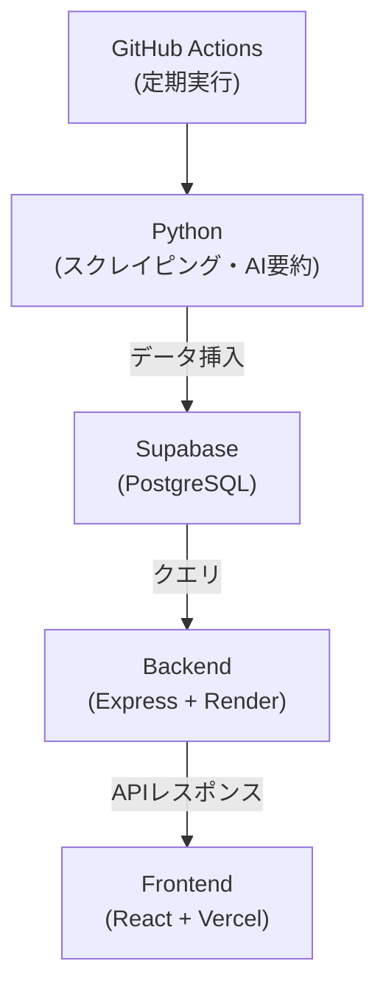

# AI求人ダッシュボード

AIと自動化技術を活用して、求人データを収集・分析・可視化するフルスタックWebアプリケーションです。  
React + TypeScript + Supabase + OpenAI を組み合わせ、求人トレンドやスキル傾向を自動算出・可視化できる仕組みを構築しました。
毎朝10時に求人データが自動収集され、ダッシュボードに反映されます。※現状一部ダミーデータが入っております。

---
## バージョン情報

**バージョン:** v1.0.0  
- **公開日:** 2025年10月9日 

本バージョンは、AI求人分析ダッシュボードの **初期公開版（プロトタイプ）** です。  

---

## デモURL

- フロントエンド（Vercel）  
  [https://ai-job-dashboard-plum.vercel.app/](https://ai-job-dashboard-plum.vercel.app/)

- バックエンド（Render / REST API）
  [https://ai-job-dashboard-ztxo.onrender.com/api/jobs](https://ai-job-dashboard-ztxo.onrender.com/api/jobs)
 

---

## プロジェクト概要

このアプリケーションは「求人情報 × AI分析」をテーマにしたデータ分析ダッシュボードです。  
Pythonで求人情報をスクレイピングし、Supabaseに格納。  
Azure OpenAI APIで要約・スキル抽出を行い、Reactで構築したダッシュボード上にトレンド分析を可視化します。

| 機能 | 概要 |
|------|------|
| 求人スクレイピング | PythonでIndeedやGreenなどから求人情報を自動収集 |
| AI要約・スキル抽出 | Azure  OpenAI APIを用いて職種情報を自動要約・スキル分類 |
| トレンド分析 | 職種別・スキル別に時系列グラフで傾向を可視化 |
| データベース連携 | Supabaseを使用したデータ永続化とAPI提供 |
| ダッシュボードUI | TailwindCSSとRechartsによるレスポンシブグラフ表示 |

---

## 技術構成

| 分類 | 使用技術 |
|------|-----------|
| フロントエンド | React, TypeScript, Vite, TailwindCSS |
| バックエンド | Node.js (Express), TypeScript, ts-node |
| データベース | Supabase (PostgreSQL) |
| AI / LLM | Azure OpenAI API (GPT-4) |
| データ分析 | Python, BeautifulSoup, pandas |
| デプロイ | Vercel（フロントエンド）, Render（バックエンド） |
| 環境管理 | dotenv, .env, GitHub Actions |

---

## ディレクトリ構成

ai-job-dashboard/
├── frontend/ # React + Tailwind (UI)
│ ├── src/
│ └── .env
├── backend/ # Express + TypeScript (API)
│ ├── src/
│ │ ├── routes/
│ │ │ ├── jobs.ts
│ │ │ └── trends.ts
│ │ └── db.ts
│ └── .env
└── analysis/ # Pythonスクリプト (データ収集・解析・機械学習)
├── scrape_jobs.py
├── trend_score.py
└── trend_forecast.py

## 環境変数

### Backend (.env)
SUPABASE_URL=https://xxxx.supabase.co
SUPABASE_SERVICE_KEY=xxxx
OPENAI_API_KEY=sk-xxxx

### Frontend (.env)
VITE_API_URL= [https://ai-job-dashboard-ztxo.onrender.com](https://ai-job-dashboard-ztxo.onrender.com)

---

## システム構成図

---

##　コメント

このアプリは「AI × 自動化 × 可視化」をテーマに、
求人情報の収集から分析・可視化までを一貫して自動化することを目的として開発しました。
SupabaseやOpenAIなどの最新ツールを活用し、
フロントエンドからバックエンド、データ分析まで全てをTypeScriptとPythonで構築しています。

---

##　今後のアップデート予定

[ ]異常検知
[ ]Supabaseトリガーによる自動再集計
[ ]PDFまたはCSVへのエクスポート機能
[ ]トレンドグラフの動的フィルタリング（期間・スキル別）
[ ]UIの調整

---

